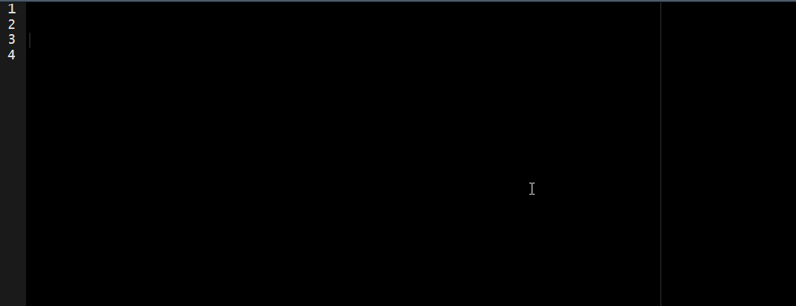

<!-- README.md is generated from README.Rmd. Please edit that file -->

# autograder

<!-- badges: start -->

[](https://lifecycle.r-lib.org/articles/stages.html#experimental)
[](https://CRAN.R-project.org/package=autograder)
[](https://renkulab.io/gitlab/the-graph-courses/autograder/-/commits/master)
[](https://renkulab.io/gitlab/the-graph-courses/autograder/-/commits/master)
<!-- badges: end -->

The goal of `autograder` is to house autograder functions for The GRAPH
Courses.

## Installation

You can install the development version of autograder like so:

``` r
if(!require("pacman")) install.packages("pacman")
pacman::pacman::p_load_gh("graph-courses/autograder")
```

or

``` r
if(!require("remotes")) install.packages("remotes")
remotes::install_git(url = "https://renkulab.io/gitlab/the-graph-courses/autograder.git")
```

## Example

This is a basic example which shows you how to solve a common problem:

``` r
library(autograder)
```

First, create a `.scores` object to set the *total number of questions*
in one lesson.

For this, use the `rep()` function to set this as the number of `times`
to repeat the value `-1` (why? go to *extra details*).

-   For `1` question: `.scores <- rep(-1, times = 1)`
-   For `2` questions: `.scores <- rep(-1, times = 2)`
-   For `n` questions: `.scores <- rep(-1, times = n)`

``` r
# one question
.scores <- rep(-1, times = 1)
```

Second, write a `check_q*()` function:

``` r
.check_q1 <-
  function() {
    
    # set number
    .problem_number <<- 1
    
    # write the right answer
    .q1_correct <- nrow(iris)
    
    # write one common mistake
    .q1_mistake <- ncol(iris)
    
    .autograder <<-
      function(){
        if (is.character(q1)) .na(message = "Your answer should be a data frame.")
        if (q1 == .q1_mistake) .fail(message = "You calculated the number of columns.")
        if (q1 == .q1_correct) .pass(message = "Correct! You are groovy!")
        else .fail()
      }
    .run_autograder()
  }
```

Third, use the `check_q*()` function to evaluate all the scenarios
detailed inside it:

``` r
# invalid
q1 <- c(1,1)
.check_q1()
#> Invalid answer. Please check your work
#>   1

# na not dataframe
q1 <- "YOUR ANSWER HERE"
.check_q1()
#> Your answer should be a data frame.
#>   1

# fail other
q1 <- iris
.check_q1()
#> Invalid answer. Please check your work
#>   1

# fail mistake
q1 <- ncol(iris)
.check_q1()
#> You calculated the number of columns.
#>   1

# pass correct
q1 <- nrow(iris)
.check_q1()
#> Correct! You are groovy!
#>   1
```

Lastly, use the `.score_print()` function to print the final scores:

``` r
.score_print()
#> 
#>   1
#> ☐ Answered: 1 of 1
#> ✔ Correct: 1 of 1
#> → Score so far: 100 %
#> Hurray! HO-HO!-HURRAY! This is clearly bedazzling!
```

## Extra details

### Scoring logic

Current logic:

-   `-1` \~ NA
-   `0` \~ wrong
-   `1` \~ correct

This logic is open to additional categories, for example, `.5` \~ half
score.

Given this logic, in the `.scores` object we set `-1` as a default
value.

### Snippets

Quickly generate a template for a `check_q*()` function:

<!--  -->
<!-- last knitr update https://stackoverflow.com/a/70665396/6702544 -->


For more details about snippets visit this [blog post full of
gifs](https://appsilon.com/rstudio-shortcuts-and-tips/) or this [rstudio
article](https://support.rstudio.com/hc/en-us/articles/204463668-Code-Snippets-in-the-RStudio-IDE).

To add this snippet in your own Rstudio:

-   First, go to the [snippets section of this project (following this
    link)](https://renkulab.io/gitlab/the-graph-courses/autograder/-/snippets/1642)
    and push the **`Copy file contents`** button (top right).
    
-   Then, in Rstudio go to: *Tools -\> Global Options -\> Code -\>
    Snippets -\> Edit Snippets*,
-   Finally, **paste** the content at the bottom of all the default
    snippets.

### Internal functions

Create a grid with the score of each question:

``` r
.score_grid()
#> 
#>   1
```

Create a heart spinner:

``` r
.spinner_function()
```

<!-- 

if linux then cli examples on readme like 

ref
https://github.com/r-lib/asciicast#limitations

---
title: autograde
output:
  md_document:
    variant: markdown_github
always_allow_html: yes
---

` ``{r, include = FALSE, cache = FALSE}
knitr::opts_chunk$set(
  collapse = TRUE,
  comment = "#>",
  fig.path = "man/figures/README-",
  out.width = "100%",
  cache = TRUE
)
Sys.setenv(CLI_TICK_TIME = "100")
# Turn on ANSI colors
options(cli.num_colors = 256L)
asciicast::init_knitr_engine(
    startup = quote({
        library(cli)
        set.seed(1) }),
    echo = TRUE, 
    same_process = FALSE,
    echo_input = FALSE,
    options = list(
        asciicast_end_wait = 3
    )
)
` ``


` ``{asciicast cli-score}
.scores <- rep(-1, times = 3)   # Put total number of questions as `times` argument
.score_grid()
` ``

-->
<!-- ----- -->
<!-- # autograder -->
<!-- Package to house autograders for The GRAPH Courses -->
<!-- ## Introduction -->
<!-- This is a Renku project - basically a git repository with some -->
<!-- bells and whistles. You'll find we have already created some -->
<!-- useful things like `data` and `notebooks` directories and -->
<!-- a `Dockerfile`. -->
<!-- ## Working with the project -->
<!-- The simplest way to start your project is right from the Renku -->
<!-- platform - just click on the `Environments` tab and start a new session. -->
<!-- This will start an interactive environment right in your browser. -->
<!-- To work with the project anywhere outside the Renku platform, -->
<!-- click the `Settings` tab where you will find the -->
<!-- git repo URLs - use `git` to clone the project on whichever machine you want. -->
<!-- ### Changing interactive environment dependencies -->
<!-- Initially we install a very minimal set of packages to keep the images small. -->
<!-- However, you can add python and conda packages in `requirements.txt` and -->
<!-- `environment.yml`, and R packages to `install.R` (listed as, for example, -->
<!-- `install.packages("ggplot2")`), to your heart's content. If you need more fine-grained -->
<!-- control over your environment, please see [the documentation](https://renku.readthedocs.io/en/latest/user/advanced_interfaces.html#dockerfile-modifications). -->
<!-- ## Project configuration -->
<!-- Project options can be found in `.renku/renku.ini`. In this -->
<!-- project there is currently only one option, which specifies -->
<!-- the default type of environment to open, in this case `/rstudio`. -->
<!-- ## Moving forward -->
<!-- Once you feel at home with your project, we recommend that you replace -->
<!-- this README file with your own project documentation! Happy data wrangling! -->
